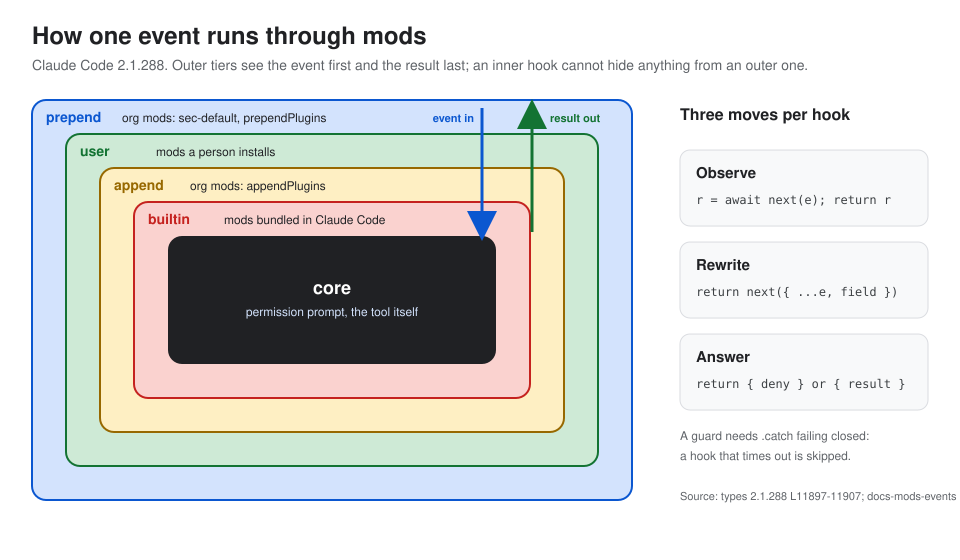

<p align="center">
  
</p>

<h1 align="center">Claude Mods Brain</h1>

<p align="center"><b>That pane, that band, that held command: all of it is a mod.</b><br/>This is everything worth knowing about Claude Code mods, with every claim linked to its source.</p>

<p align="center">
  
  
  
  
  
</p>

---

## What are Claude Code mods?

On October 1, 2026, Anthropic shipped **mods** in Claude Code 2.1.287. A mod is a small TypeScript add-on
that runs *inside* Claude Code. It can:

- **draw** a panel beside the conversation or a status line above your prompt,
- **add** slash commands and tools,
- **watch, change, or block** what Claude does, for example stopping a risky command until you approve it.

That is a lot of power, and it moves fast. Mods are not sandboxed: a mod runs with your permissions. And
the API can change between releases. This brain exists so you can learn mods, build them, and judge
someone else's mod before you install it, without guessing.

## What you get

| | |
|---|---|
| **Plain explanations** | How a mod is put together, how hooks chain around Claude Code, every event family, the `$` API, where a mod can draw, and its time and size limits. |
| **Step-by-step recipes** | Build a status band, a pane, a slash command, or a guard that holds a risky tool call. Migrate old settings hooks. Test and publish. |
| **A safety checklist** | What a mod can reach, what it costs you in usage, how prompt injection gets in, and an ordered audit you can run before installing anything. |
| **A graded catalog** | 40 built-in, official, and community mods, each pinned to a commit, with what it touches and an *adopt*, *trial*, or *avoid* verdict and the reason. |
| **Patterns and pitfalls** | What works, what breaks, and why, gathered from the docs and the 235-comment design thread. |
| **Small tools** | A scanner that reads a mod without running it, and a drift check that tells you which notes to re-check after a Claude Code update. |

<p align="center">
  
</p>

## How to use it

**1. Read it like a book.** Open this folder as a vault in [Obsidian](https://obsidian.md) and start at
`wiki/meta/Start Here.md`. It splits into four paths: *understand mods*, *build a mod*, *check someone
else's mod*, and *keep this brain current*. Every note links to its neighbours, so the graph view is a
good map.

**2. Ask it questions in Claude Code.** Copy `agents/mods-secretary.md` into your project's
`.claude/agents/` folder, open Claude Code here, and ask things like:

> *"How do I hold a Bash call until I approve it?"*
> *"Is this mod safe to install?"*
> *"Claude Code just updated. What do I need to re-check?"*

The agent answers from the notes, cites the note and the official page, and never installs or runs a mod
for you.

**3. Check a mod before you install it.** With Python 3.10 or newer:

```bash
python3 -m mods_brain.cli audit-mod path/to/some-mod --origin owner/repo@abc1234 --tested-on 2.1.288 --date 2026-10-03
```

You get a report covering which events the mod hooks, what it calls, how far it reaches (from *draws only*
to *network*), whether it can spend your usage, and red flags such as *downloads code and then runs it*.
A clean report is a starting point, not a verdict. The checklist in the vault covers what a scan
can't see.

## Why you can trust it (and where you shouldn't)

- **Every claim has a source.** Notes cite the official docs page or the exact lines of the type
  definitions Claude Code ships, with the date each source was read. The ledgers in `references/` list
  all 50 sources and every tracked claim with its verdict.
- **Every claim names its version.** Facts are marked *tested on 2.1.288*. When Claude Code moves on,
  the drift check shows what changed.
- **Disagreements are kept, not hidden.** Where the docs, the type definitions, and blog posts disagree,
  the [Contradictions Register](wiki/sources/Contradictions%20Register.md) shows both sides and which one
  wins.
- **Confidence is labelled.** Each recommendation carries *evidence-based*, *practitioner*, *contested*,
  or *folklore*.
- **The limits are stated.** Nothing here was proven by actually loading a mod. Runtime behaviour comes
  from the docs and the type definitions, and code samples were type-checked, not run. Where that
  matters, the note says so.

## Keeping it current

Mods are new and the API "may change between releases without notice". When Claude Code updates, follow
`wiki/flows/Research Refresh Workflow.md`. In short: capture the new type definitions, run the drift check,
and re-read the notes it lists.

## What's in the box

```text
wiki/          the knowledge: concepts, flows, deliverables, catalog entries, reports
references/    source ledger, claim ledger, canon summaries, generated API data
scripts/       the scanner, drift check, and report renderers (plain Python, no dependencies)
schemas/       JSON Schemas for every generated file
tests/         tests with synthetic fixtures (no real mod is ever run)
agents/        the mods-secretary agent for Claude Code
```

No copies of third-party documentation are included: the vault links to the original pages instead.

## Credits and licenses

- **Notes and other written content** (`wiki/`, `references/`, `agents/`): [CC BY 4.0](LICENSE-CONTENT).
  Reuse them freely, with credit.
- **Code** (`scripts/`, `mods_brain/`, `tests/`, `schemas/`): [MIT](LICENSE).
- *Claude* and *Claude Code* are trademarks of Anthropic. This is an independent project, not affiliated
  with or endorsed by Anthropic.

Made by [Daniel Agrici](https://github.com/AgriciDaniel). Corrections and new sources are welcome: see
[CONTRIBUTING](CONTRIBUTING.md).
