# Start Here

This vault is a source-cited brain for Claude Code mods, tested on Claude Code 2.1.288. Run `claude --version` first: if it is newer, the API notes may be stale until [[Re-verify After Release Flow]] runs. Then pick the path that matches what you came to do. #confidence/practitioner

## I want to understand mods

1. [[overview|Overview]]: the domain in five layers.
2. [[Mod Anatomy]], then [[Hook Middleware Chain]] and [[Observe Rewrite Answer]].
3. [[Mods API Cheatsheet]] for names, signatures, and limits; [[API Surface 2.1.288]] for the full generated list.
4. [[Mods vs Classic Hooks]] if you already use settings hooks.

## I want to build a mod

1. [[Patterns Playbook]] and [[Pitfalls Playbook]].
2. The matching flow: [[Build a Status Band Flow]], [[Build a Pane Flow]], [[Build a Slash Command Flow]], [[Build a Tool Call Guard Flow]], or [[Migrate a Classic Hook Flow]].
3. [[Testing Playbook]] and [[Plugin Validate]] before any load; [[Publish a Mod Flow]] to ship.
4. [[Ranked Build Ideas]] for what is still worth building.

## I want to install or audit someone else's mod

1. [[Mod Catalog]] for a verdict if the mod is already graded.
2. [[Audit a Third-Party Mod Flow]] with the [[Mod Security Audit Checklist]]; run `python3 -m mods_brain.cli audit-mod <dir>`.
3. [[Mods Trust Model]], [[Reach Levels]], [[Usage Cost Surface]], and [[Prompt Injection via Mods]] explain the findings.
4. For a team: [[Org Mod Controls]] and [[Org Mod Policy Guide]].

## I maintain this brain

1. [[hot|Hot]], [[log|Log]], and [[dashboard|Dashboard]].
2. [[Research Refresh Workflow]] after every Claude Code release; [[Source Intake Workflow]] for new sources; [[Claim Verification Flow]] before promoting a claim.
3. [[CONVENTIONS]] for the note contract; [[Tag Taxonomy]] for tags and graph colors.
4. Run `bash references/orchestration/run_gates.sh` before any commit.

## Rules that never bend

- Never install, enable, or load a mod without the owner's approval; audited repos are read-only. See [[Read Only Audit Decision]].
- Every API claim names its tested-on version and a dated source.
- A passing validate or a clean scan is evidence, not a verdict.

Related: [[index|Index]] | [[Best Practices Kernel]] | Approval Queue
